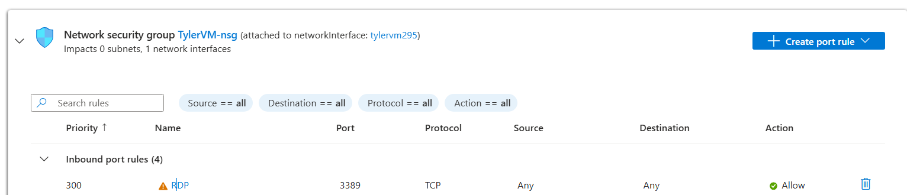
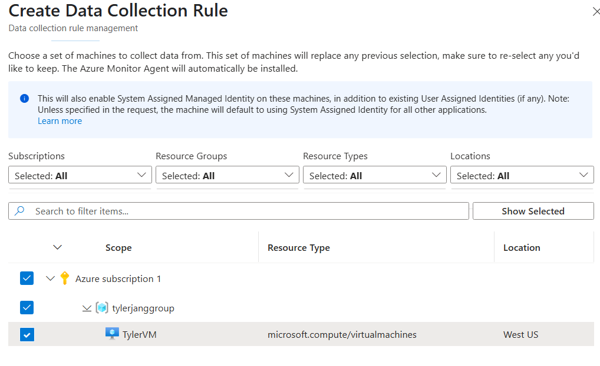
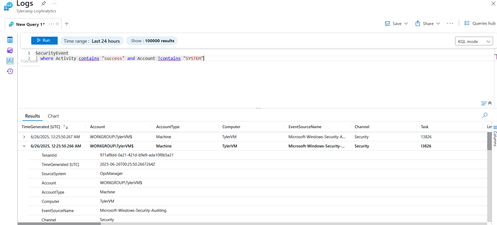
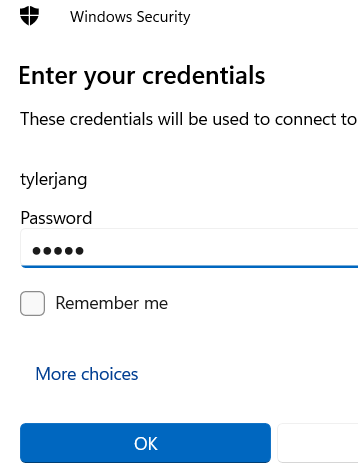
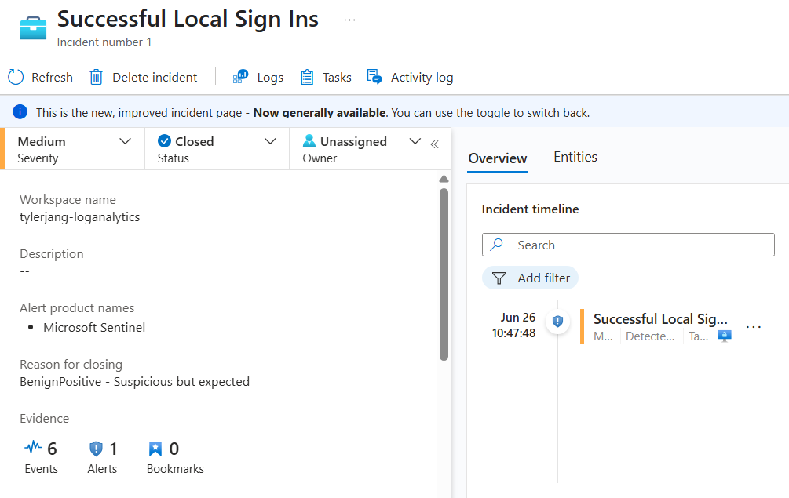
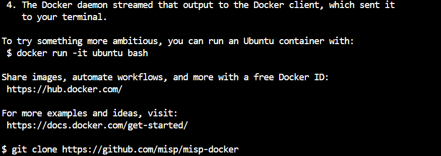
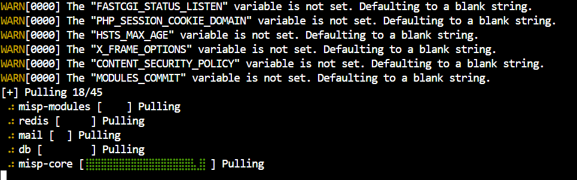
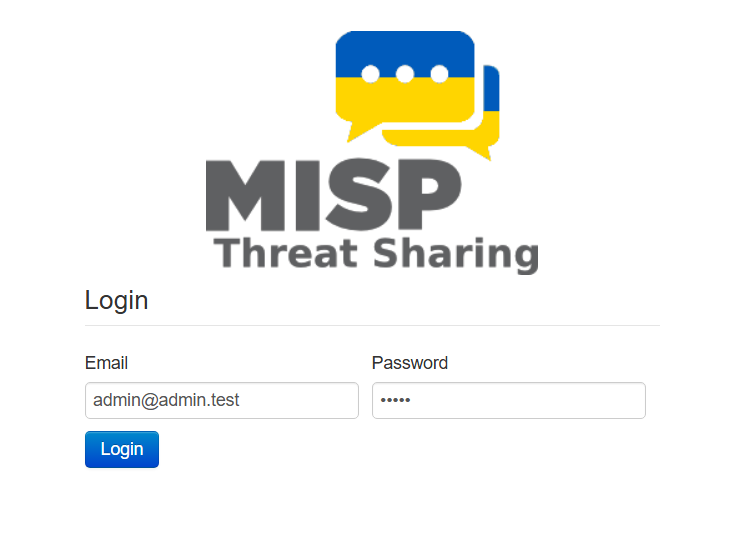
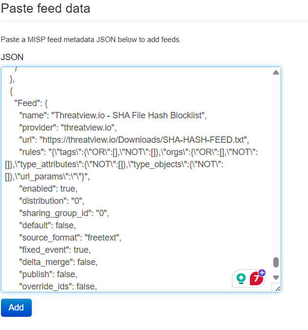

# Building a home SOC with Microsoft Azure

* * * 

### Creating a VM and integrating Microsoft Sentinel to build a simple RDP honeypot 

Since I'm eventually going to try to set up Active Directory, I decided to make a Windows 10 VM with RDP open to test the SIEM I'll be setting up.

To configure Microsoft Sentinel to collect event data from my VM, I had to add a data connector to listen to Windows Security events via Azure Monitor Agent. After everything was installed and deployed, I looked at the security event logs that were already generating. Since I wasn't too familiar with all the fields, I looked at each field and value of the security event logs and decided to filter out what I didn't need, which was the system notifications. 

I created this query to not only filter for successful events, such as a successful logon, but to filter out any unnecessary noise, like the system logs. Since I have not yet logged on to the VM, the query yielded no results. All that was left to do after this was to add this to an alert rule on Sentinel and have it periodically check and add to an incident when it detects anything that corresponds with the query. 

 

As expected, when I log in with RDP on my local machine, it generates an incident alert on Sentinel. 

### Creating a threat intelligence feed 
To pull in threat intelligence without relying on already existing Microsoft tools, I had to add another data connector to Sentinel, which was MISP, an open-source threat intelligence platform. To download the MISP feed, I needed to create a new Ubuntu VM so that I could use the command line and Docker to install MISP. After connecting to the VM via SSH through Azure CLI, I downloaded Docker as well as the Docker image of MISP. 
 

I cloned the Docker image from GitHub, then followed the documentation to host the MISP web interface. Even after following the directions and opening up inbound connections to the VM to port 443 for HTTPS using the public IP of the Ubuntu VM (which is where the web interface is), I wasn't able to connect from my local computer. After HOURS of troubleshooting, I was finally able to debug it by removing a bad dhparams.pem file (upon research, it's what allows two parties to agree on an encryption key) and manually creating a new one. 

Since this was publicly facing, I had to change the password. The next step was to pull in feeds for MISP, so I went to the MISP website for the default feeds in JSON format and pasted the entire thing into the MISP feeds. 

Now, all that was left to do was enable all those feeds, and it was successfully pulling threat indicators from the VM. The next thing I need to do is feed those into Microsoft Sentinel via the data connector. This integration was really rigorous, and following an online tutorial, I had to make a new app registration, create a new "client secret" under that, make a new contributor role under my log analytics workspace, which was made for Sentinel, all of which helps integrate MISP. The final step was to make a function app, which will run the Python code that's needed to send the indicators to Sentinel. The video told me to make a few changes to the code, which consisted of changing variable names and deleting certain functions that conflicted. 
