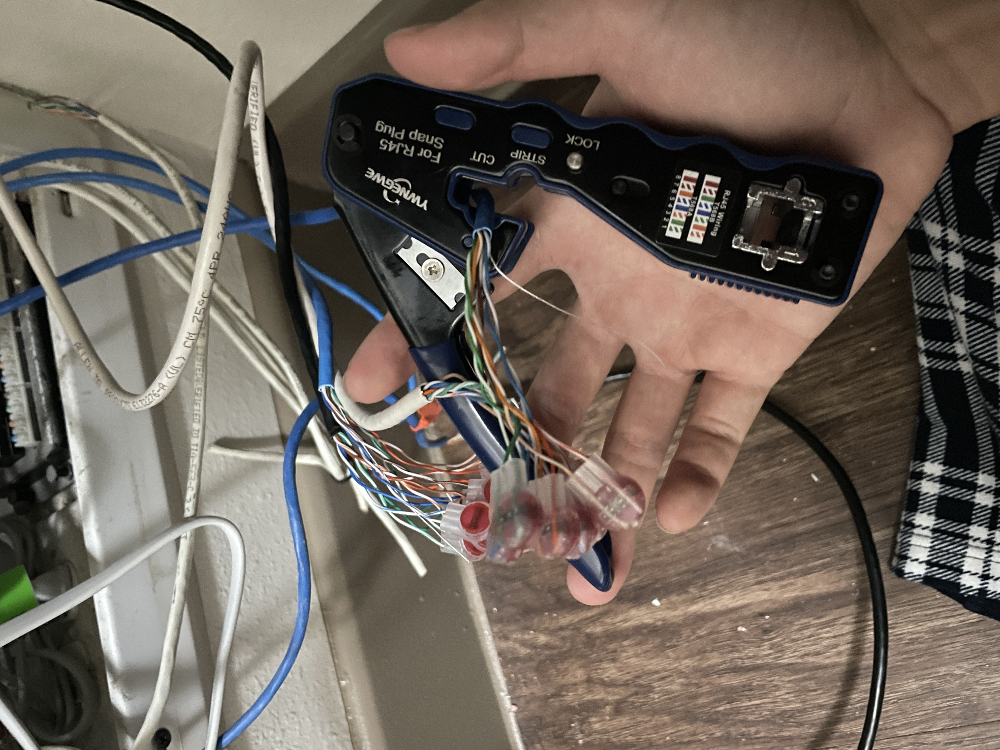
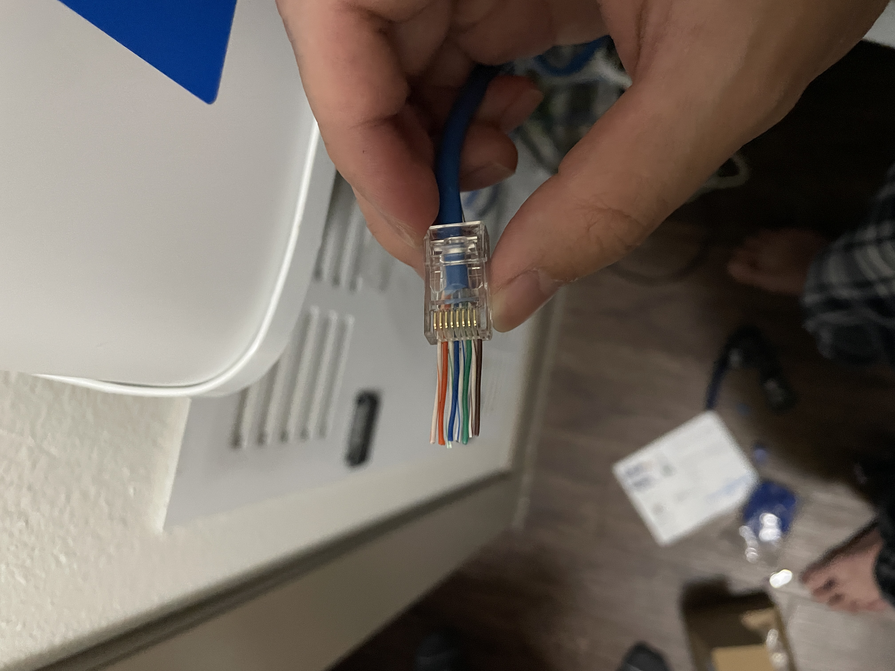
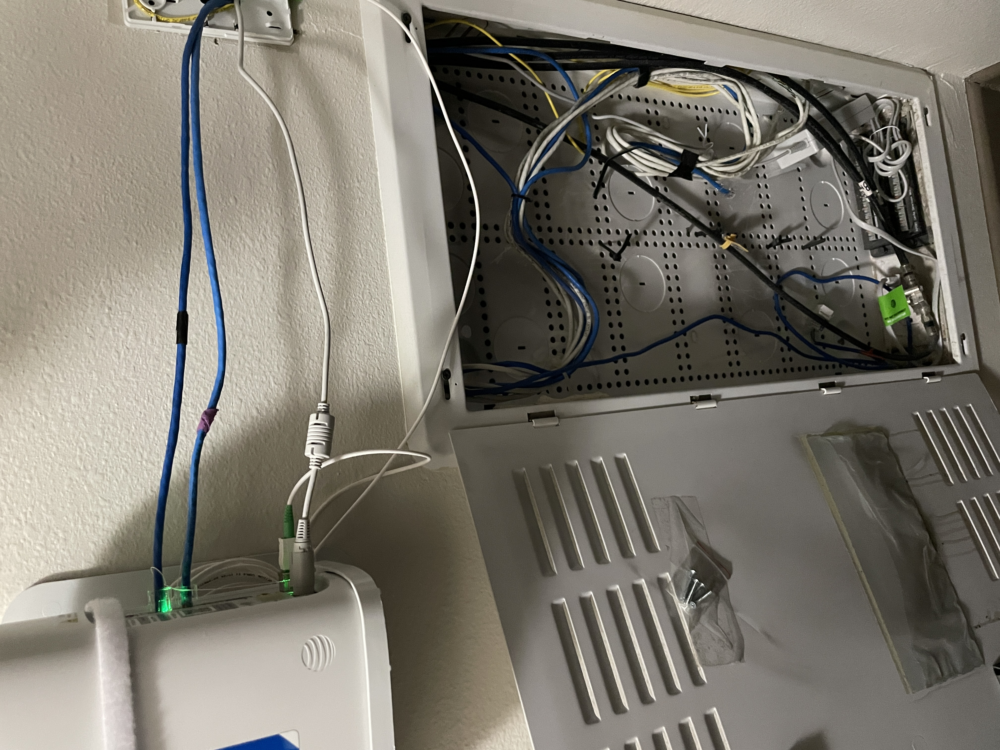

# Residential Ethernet Infrastructure Re-Termination & Optimization
When I moved into my home, I realized that when I plugged in the cat5e cable into my pc from the wall port, I didn't receive any connectivity. The technician had came in and set up the wifi and "supposedly" got the wall port working too. The wifi was working fine so I concluded it was the ethernet port on the wall that was the problem, probably the connectivity from the router. When I opened the panel in which our technician installed the router, I saw that the ethernet connection ran from the router -> white/black cat 5e cable -> connected to the blue cat 5e cable feeding into the wall connected by a gel filled cable splicer (I had to look this up). 

After research, I saw that this type of connection can result in efficiency of the cables, so I decided to buy a crimper kit myself to directly feed the cat5e cables into the router to optimize efficiency and for a cleaner look in the patch panel. I started off by cutting this mess of a connection off with the wire cutter that came with the kit. Then I had to strip the cable from the protective wiring to make room to crimp the cables to a rj45 plug. Looking at the cables, I was able to determine that the cables used the T-568B standard where it starts with the orange wires first. So I untwisted the cable pairs and straightened them out to arrange them into the correct order and put them through the plug (this image actually showed the reverse order, which ended up causing issues and was fixed later) 

I crimped the wires to the rj45 plug using the crimper kit, plugged it into the router, tested the connectivity with my laptop, and it worked! I crimped another cable that connected my roommates ethernet and fixed his too. I cleaned up and performed some cable management to make it look neater and put aside the cables that I didn't need. 

